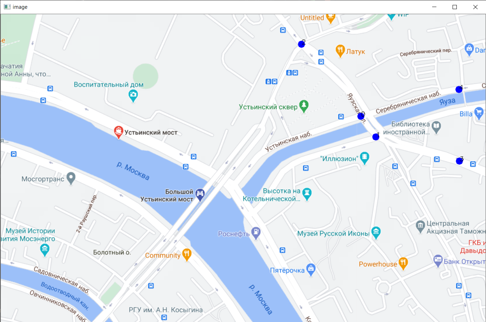
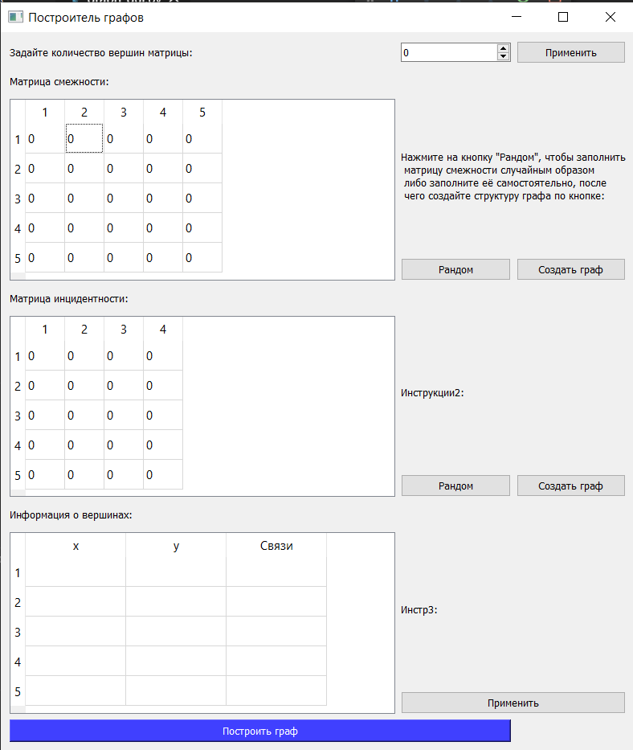
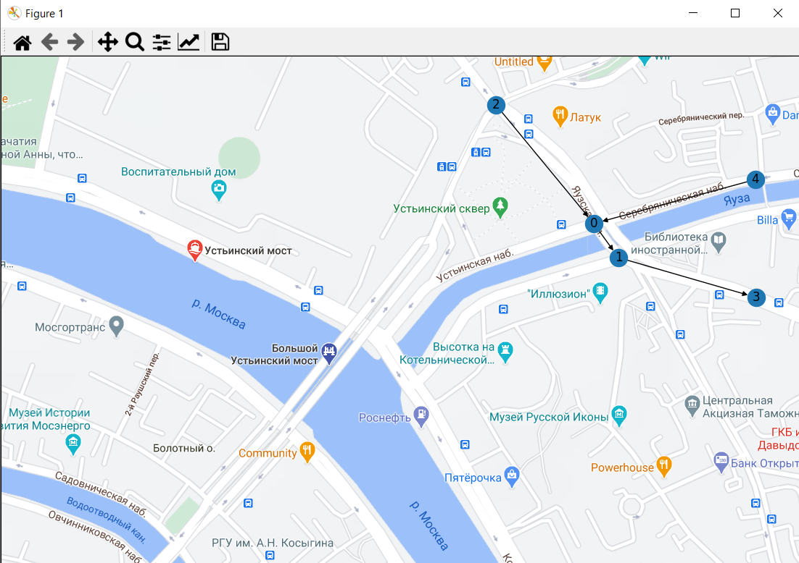

# Построитель графов
Построение транспортного графа на карте, по матрице смежности и инцидентности, с заданными пользователем координатами. Пользователь может задать координаты на карте, заполнить матрицу смежности случайным образом или вручную в виджете PyQt5, после чего создаётся структура графа Networkx, строится матрица инцидентности и таблица информации о вершинах (при помощи Numpy). При нажатии на кнопку "Построить граф", пользователю показывается окно Matplotlib с графом, построенным на карте.  
Библиотеки: PyQt5, Networkx, Matplotlib, Numpy.  
Иллюстрация работы программы: 
Пользователь ставит вершины графа 
 
Окно GUI: 
 
Окно результата Matplotlib: 
 
